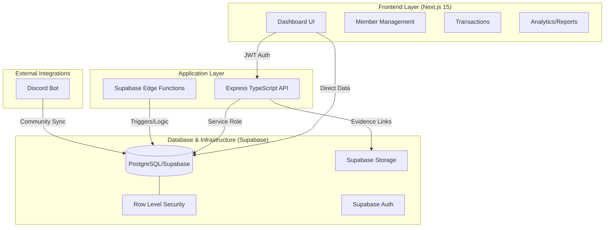

# 🎮 Valhalla: Enterprise Guild Management Platform

<p align="center">
  <strong>A high-scale community management ecosystem for modern gaming guilds</strong><br>
  Built with Next.js 15, Express, and Supabase Orchestration
</p>

<p align="center">
  
  
  
  
  
</p>

---

## 📝 Overview

**Valhalla** is a production-ready community management hub designed for large-scale gaming organizations. It automates the complexities of guild operations—from member rosters and role-based access to financial transaction ledgers and automated loot distribution.

This project showcases **Senior Full-Stack Proficiency**, integrating modern web frameworks with cloud-native backend services and real-time community tools.

---

## 🏗️ Technical Architecture

Valhalla utilizes a **Hybrid Backend Strategy**: Leveraging Supabase for real-time data, storage, and serverless edge functions, while maintaining a Node.js Express API for complex business orchestration.



---

## ✨ Key Features

- **📊 KPI Dashboard**: Real-time visibility into guild health, monthly revenue, and latest community activity using **Recharts**.
- **🛡️ RLS-Driven Security**: Multi-guild isolation at the database level using **Supabase Row Level Security**.
- **💰 Financial Ledger**: Robust transaction management system with evidence upload support and multi-step confirmation flows.
- **📦 Loot Engine**: Advanced distribution engine for guild assets with automated share calculation and validation.
- **👥 Roster Management**: Dynamic member management with role-based permissions and active status tracking.
- **📄 Pro Reporting**: Period-based financial reports with **CSV export** capability.

---

## 🛠️ Tech Stack

### Frontend
- **Framework**: Next.js 15 (App Router)
- **Styling**: Tailwind CSS + shadcn/ui
- **State Management**: TanStack Query (React Query)
- **Charts**: Recharts
- **Forms**: React Hook Form + Zod

### Backend
- **Core API**: Node.js + Express + TypeScript
- **Cloud Native**: Supabase Edge Functions (Deno)
- **Database**: PostgreSQL (Supabase)
- **Identity**: Supabase Auth (JWT)
- **Storage**: Supabase Storage (Private Buckets)

---

## 🚀 Getting Started

### 📌 Prerequisites
- Node.js 18+
- [Supabase CLI](https://supabase.com/docs/guides/cli)
- Docker (for local Supabase stack)

### 1. Local Database Setup
Initialize and start the local Supabase environment:
```bash
supabase start
supabase db reset # Appiles schema, RLS, and seed data
```

### 2. Configure Environment
Create `.env` files for both the API and Web layers:
- `api/.env`: Supabase URL, Service Role Key
- `web/.env.local`: Supabase URL, Public Anon Key

### 3. Launch Development Environment
```bash
# Terminal 1: API
cd api && npm install && npm run dev

# Terminal 2: Web Dashboard
cd web && npm install && npm run dev
```

---

## 📖 API Reference

| Method | Endpoint | Description |
| :--- | :--- | :--- |
| **GET** | `/api/v1/dashboard` | Fetch guild analytics and KPIs |
| **GET** | `/api/v1/guilds` | List authorized guilds |
| **POST** | `/api/v1/guilds/:id/members` | Add new member to roster |
| **POST** | `/api/v1/guilds/:id/transactions` | Initiate new transaction |
| **POST** | `/api/v1/guilds/:id/loot/distribute` | Launch loot distribution |

---

## 👨‍💻 Author

**Fitry Yuliani**

---

<p align="center">
  <strong>Built for the Next Generation of Communities. 🚀</strong>
</p>
